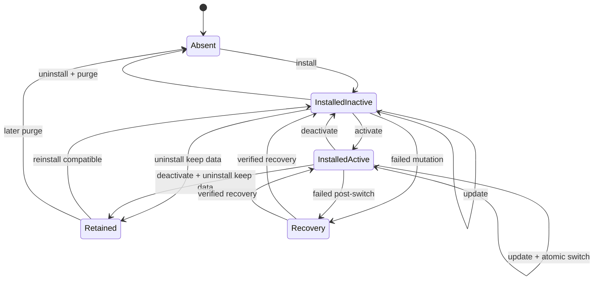

# ModulNest 2.0 module architecture

- Status: **ModulNest 2.0.0-rc.2** – öffentlicher Release Candidate des vollständigen Modul-v2-Systems
- Entwicklungsbranch: `develop/2.0`
- Basis: privater Stand `659cde8b5ed59a530e4a5952d5a7ef48fc8f06d9` (`develop/1.0`, ModulNest 1.2.0)
- Ziel: ModulNest 2.0 – unabhängiges Modulsystem und **Modul-Katalog**

## 1. Ziele

ModulNest 2 trennt Core- und Modul-Releases. Ein reguläres Modul muss unabhängig
vom Core installiert, aktualisiert, deaktiviert und deinstalliert werden können.
Core `2.1.0` und Wiki `1.5.0` sind voneinander unabhängige Versionen.

Verbindliche Ziele:

- Der Modul-Katalog und die komplette Lifecycle-Infrastruktur gehören zum Core.
- Eine global eindeutige, unveränderliche Modul-ID identifiziert Code, Aktivierungszustand, Daten,
  Releases, Abhängigkeiten und Katalogeinträge durchgängig.
- `modules.is_active` bleibt die einzige Wahrheit für Aktiv/Deaktiviert. Der
  Modul-Katalog und die heutige Modulverwaltung benutzen denselben Service.
- Modulcode und Moduldaten werden physisch und logisch getrennt.
- Deinstallation entfernt standardmäßig nur Code; Daten bleiben registriert.
- Ein späterer Purge funktioniert ohne den entfernten Modulcode und kann nur
  zuvor vom Core registrierte Ressourcen des Moduls löschen.
- Katalog-, manuelle, lokale und Legacy-Module bleiben unterscheidbar.
- Installationen und Updates sind vorab prüfbar, protokolliert, wiederaufnehmbar
  und lassen bis zur finalen Umschaltung den alten Code aktiv.
- Alle regulären Non-Core-Module nutzen diesen Lifecycle vor 2.0 Final.

## 2. Nicht-Ziele

- Kein allgemeiner PHP-/Composer-Paketmanager und kein Ersatz für Composer.
- Kein Bezahlsystem, Store oder Marktplatz.
- Keine sichere Sandbox für PHP-Module. Installierte Module laufen mit den
  Rechten der ModulNest-PHP-Anwendung; Vertrauen und Signaturen sind deshalb
  zwingend, nicht optionales Beiwerk.
- Kein automatisches Datenbank-Downgrade. Modulmigrationen bleiben vorwärts
  gerichtet und müssen mindestens mit dem unmittelbar vorherigen Code-Release
  kompatibel sein.
- Kein ungefragtes Übernehmen oder Überschreiben lokaler/manueller Module.
- Kein 2.0-Release. Der beschriebene Foundation-/Katalog-Slice ist auf
  `develop/2.0` implementiert; weitere Produktmodule werden schrittweise migriert.

## 3. Aktueller Ist-Zustand (1.2.0)

### 3.1 Discovery, Aktivierung und Routing

`NativeModuleLoader` durchsucht `app/Modules/*` und erwartet die Klasse
`Modulon\Modules\<Ordner>\<Ordner>Module`. `Admin`, `Auth` und `Modules`
werden explizit übersprungen. Alle anderen nativen Module implementieren
`NativeModuleInterface` und liefern Metadaten, Factory, Routen, Navigation und
ein `nativeBinding()`.

Die Modulverwaltung öffnet die Discovery und legt neue Modulzeilen deaktiviert
an. Der Bootstrap erzeugt nur aktive native Module; deren Routen und
Navigation werden registriert. Der relevante Zustand liegt in der Tabelle
`modules`, insbesondere `route_prefix`, `handler` und `is_active`. Der heutige
`metadata()['key']` ist nicht als persistente, unveränderliche Identität
abgesichert; faktisch dient häufig der editierbare `route_prefix` als Schlüssel.

`Admin`, `Auth` und Teile der Modulverwaltung werden direkt in
`app/bootstrap.php` verdrahtet. Zusätzlich kennt der Bootstrap konkrete
Sonderfälle für Homepage und Pages. User kennt optional FantasyCards direkt;
DataPortability kennt seine vier Fachprovider direkt. Das verhindert derzeit
vollständig unabhängige Pakete.

### 3.2 Migrationen und Installation

`MigrationRunner` entdeckt Core- und Modulmigrationen, speichert Key, Scope,
Modul-Key und SHA-256 der Migrationsdatei in `schema_migrations` und verweigert
nachträglich veränderte Migrationen. Aktivierung über die Modulverwaltung führt
Modulmigrationen aus. Clean Installs verwenden Core-Schema/-Seeds und die
Schemas/Seeds der ausgewählten Paketmodule.

Der Public Export erzeugt ein releaseweites `modulnest-package.json`. Der
Installer kann optionale Modulordner vor dem Kopieren entfernen. Dies ist eine
Build-/Installationsauswahl, noch kein Einzelmodulpaket und enthält keine eigene
Modulversion oder Dependencies.

### 3.3 Updater, Backup und Recovery

Der Core-Updater bietet bereits:

- eine fest erlaubte HTTPS-Metadaten- und Releasequelle,
- SHA-256-Prüfung,
- Staging und grundlegenden Zip-Slip-Schutz,
- Maintenance Flag, Datei-Backup und persistierten Update-State,
- MigrationRunner-Integration, OPcache-Refresh und Recovery-State/-UI,
- Schutz zentraler Pfade wie `.env`, `.git`, `.local` und `storage/`.

Nicht direkt wiederverwendbar sind die feste GitHub-URL, das vollständige
Core-Paketmodell und die rekursive In-place-Dateikopie. Aktuell fehlen unter
anderem Signaturen, Download-/Entpackgrößenlimits, vollständige
Symlink-/Special-File-Prüfung, eine exakte Paketdateiliste, das Entfernen alter
Dateien, ein atomarer Release-Pointer und automatischer Datei-/DB-Rollback.

**Empfehlung:** Die geprüften Bausteine werden in Core-Services extrahiert
(`PackageTransport`, `SafeArchiveExtractor`, `PackageVerifier`,
`MaintenanceManager`, `BackupService`, `OperationJournal`,
`RuntimeCacheManager`). Core- und Modul-Updater verwenden sie gemeinsam; ihre
Orchestrierung und erlaubten Zielpfade bleiben getrennt.

### 3.4 Data Portability und Generator

DataPortability ist ein optionales natives Modul mit zentralem ZIP-Format,
Preview, `merge`/`replace`, Admin-/User-Scopes und einem Provider-Interface.
Heute erzeugt `DataPortabilityModule` konkrete Provider für Dashboard, Banking,
News und Sneak Preview. Ein separat installiertes Modul kann sich daher nicht
ohne Core-/DataPortability-Änderung anmelden.

`tools/create-module.php` erzeugt ein 1.x-Scaffold an mehreren globalen Pfaden
(`app/Modules`, `app/Views`, `public/assets`, `tests`). ExampleNotes ist eine
gute ausführbare Referenz für die heutige API, aber ausdrücklich kein Paket.

### 3.5 Wichtigste Architekturdefizite

1. Code, Views, Assets und Tests eines Moduls sind über den Projektbaum verteilt.
2. Es gibt keine persistente Modulversion, Herkunft oder installierte Release-ID.
3. `route_prefix` ist editierbar und zugleich an vielen Stellen Identität.
4. Der Core kennt konkrete optionale Module; globale Composer-Abhängigkeiten
   enthalten sogar Bibliotheken privater Module.
5. `deleteModule()` löscht nur die Registry-Zeile, weder Code noch bewusst
   verwaltete Daten, und verliert die Zuordnung zu retained data.
6. Ownership für Tabellen, Settings, Storage, Uploads und Jobs fehlt.
7. Modulupdates sind nur als Bestandteil eines vollständigen Core-Updates möglich.
8. Einige ältere Module verwenden Runtime-`ensureSchema()` oder nur
   `schema.sql`; beides reicht für paketierte Updates nicht.

## 4. Core vs. Module

Ein Bestandteil gehört genau dann in den Core, wenn ModulNest ohne ihn keine
sichere Anmeldung/Administration oder keinen verlässlichen Modul-Lifecycle
bereitstellen kann. Lage unter `app/Modules` allein ist kein Kriterium.

| Bestandteil | Empfehlung | Begründung |
|---|---|---|
| Admin | Core | geschützter Administrationsrahmen, Benutzer- und Systemverwaltung |
| Auth | Core | Login, Rollen, Sessions, 2FA/WebAuthn und Access Guard |
| Modules | Core | Discovery, Aktivierungswahrheit und künftige Paketregistry |
| User/Profil | Core | eigenes Konto, Sicherheit und Core-Userpräferenzen; optionale Modulkopplungen entfernen |
| Updates | Core | Core-Update/Recovery sowie gemeinsame sichere Paketprimitiven dürfen nicht deinstallierbar sein |
| DataPortability | reguläres Modul, Core-Capability-Vertrag | Komfortfunktion darf optional bleiben; Interface/Registry müssen neutral sein |
| Systeminfo/Logs | reguläre Module | Diagnose-UIs sind entbehrlich; Core-Logging/Health-Verträge bleiben im Core |
| alle Fachmodule | reguläre Module | Produktfunktion ist ohne sie lauffähig |

Die fünf Core-Bestandteile können während der Alphas physisch noch unter
`app/Modules` liegen. Vor Final sollten sie entweder in einen klaren
`app/System`-/Core-Bereich verschoben oder in der Registry unveränderlich als
`origin=core`, `required=true`, nicht deinstallierbar markiert werden. Die
zweite Variante ist migrationsärmer; empfohlen ist zunächst diese.

Optionale Integrationen werden über Core-Registries/Capabilities invertiert:

- `RootPageProvider` statt Bootstrap-Abhängigkeit auf Homepage,
- `PublicNavigationContentProvider` statt Bootstrap-Abhängigkeit auf Pages,
- `ProfileExtensionProvider` statt User-Abhängigkeit auf FantasyCards,
- `DataPortabilityCapability` statt DataPortability-Abhängigkeit auf Fachmodule.

## 5. Modulmanifest v2

Dateiname: `module.json`, UTF-8, valides JSON, maximales Manifest-Limit 256 KiB.
Unbekannte Felder werden innerhalb derselben Major-Schemaversion ignoriert und
für Diagnose erhalten; unbekannte Pflichtfeatures (`requires_features`) führen
zum Abbruch.

### 5.1 Felder

| Feld | Stufe | Bedeutung |
|---|---|---|
| `manifest_version` | MUST | Ganzzahl `2`; Version des Vertrags, nicht des Moduls |
| `id` | MUST | unveränderliche, global eindeutige Publisher-ID, siehe unten |
| `name`, `description` | MUST | Anzeigename und kurze, rein textuelle Beschreibung |
| `version` | MUST | normale SemVer ohne führendes `v` |
| `license` | MUST | SPDX-Identifier oder `LicenseRef-*` plus Lizenzdatei |
| `authors` | MUST | mindestens Name; URL optional |
| `requires.core`, `requires.php` | MUST | unterstützte Core- und PHP-SemVer-Ranges |
| `entrypoint.class`, `entrypoint.file` | MUST | einzige Bootstrap-Klasse und relativer Pfad |
| `autoload.psr4` | MUST | paketlokale Namespace-/Pfad-Zuordnung |
| `data.schema_version` | MUST | nichtnegative, monotone Integer-Version; `0` für datenlose Module |
| `data.ownership` | MUST | deklarative, vom Core persistierte Ownership; leere Listen sind erlaubt |
| `homepage`, `repository` | SHOULD | Support, Quellcode und Transparenz |
| `requires.extensions` | SHOULD | benötigte PHP-Extensions, z. B. `curl`, `zip` |
| `dependencies` | SHOULD | benötigte Module mit SemVer-Range; Default `{}` |
| `optional_dependencies` | SHOULD | optionale Integrationen; nie implizit installieren/aktivieren |
| `conflicts` | SHOULD | bekannte, technisch nicht koexistenzfähige Modul-Ranges |
| `migrations.path` | SHOULD | paketlokaler Migrationsordner; Pflicht bei Schemaänderungen |
| `views.path`, `assets.path` | SHOULD | paketlokale Ressourcen; nur wenn vorhanden |
| `capabilities` | SHOULD | deklarierte Providerklassen für bekannte Core-Verträge |
| `data.compatible_schema` | SHOULD | lesbarer Daten-Schema-Bereich für sichere Reinstallation/Downgrades |
| `support`, `funding` | MAY | rein informative URLs |
| `requires_features` | MAY | Core-Feature-Flags, die der Installer verstehen muss |

Nicht in `module.json` gehören Paket-Hash, Signatur, Katalogquelle und
Release-Channel. Der Hash eines Archivs kann nicht zuverlässig Bestandteil
desselben Archivs sein. Diese Werte sind **MUST** im signierten Releaseeintrag
des Katalogs und im Installations-Lock gespeichert. Der Channel (`stable`,
`beta`, `nightly`) ist eine Veröffentlichungs-/Quelleneigenschaft, keine
Eigenschaft identischen Modulcodes.

Navigation und Settings werden nicht als umfangreiches UI-DSL dupliziert.
Navigation wird weiter über typisierte Provider registriert; Settings bleiben
Modulcode. Das Manifest deklariert nur die dafür nötigen Capabilities und die
Ownership persistenter Settings.

Die technische ID hat exakt zwei durch einen Punkt getrennte Segmente:
`<publisher>.<module>`. Beide Segmente erfüllen
`^[a-z][a-z0-9]*(?:-[a-z0-9]+)*$`, sind jeweils höchstens 63 Zeichen lang und
die gesamte ID höchstens 127 Zeichen. Erlaubt sind damit ausschließlich
lowercase ASCII, Ziffern und einzelne Bindestriche innerhalb eines Segments;
Punkte, leere Segmente sowie führende/abschließende oder doppelte Bindestriche
innerhalb eines Segments sind verboten. `modulnest.*` ist für signierte
offizielle Module reserviert. Beispiele: `modulnest.wiki`,
`example.weather`, `vendor.module-name`.

Modul-ID, sichtbarer Name, editierbarer Route-Prefix und Data-Portability-Key
sind getrennte Konzepte. Registry, Dependencies, Ownership und Migration-State
verwenden ausschließlich die namespaced Modul-ID. Routen und portable
Export-Keys dürfen aus Kompatibilitätsgründen abweichen und werden explizit im
Manifest beziehungsweise Provider deklariert; es gibt keine heuristische
Ableitung.

### 5.2 Beispiel: Wiki

```json
{
  "manifest_version": 2,
  "id": "modulnest.wiki",
  "name": "Wiki",
  "description": "Synchronisierte Markdown-Dokumentation aus GitHub oder einem lokalen Verzeichnis.",
  "version": "1.5.0",
  "license": "MIT",
  "authors": [{"name": "ModulNest Project"}],
  "homepage": "https://github.com/ChobitsChii/ModulNest",
  "repository": "https://github.com/ChobitsChii/ModulNest",
  "requires": {
    "core": ">=2.0.0 <3.0.0",
    "php": ">=8.3.0 <9.0.0",
    "extensions": ["curl", "zip"]
  },
  "entrypoint": {
    "class": "ModulNest\\Wiki\\WikiModule",
    "file": "src/WikiModule.php"
  },
  "autoload": {
    "psr4": {"ModulNest\\Wiki\\": "src/"}
  },
  "dependencies": {},
  "optional_dependencies": {
    "modulnest.data-portability": ">=2.0.0 <3.0.0"
  },
  "conflicts": {},
  "migrations": {"path": "migrations"},
  "views": {"path": "views"},
  "assets": {"path": "assets"},
  "capabilities": {
    "admin_navigation": "ModulNest\\Wiki\\WikiAdminNavigationProvider",
    "data_portability": "ModulNest\\Wiki\\WikiDataPortabilityProvider"
  },
  "data": {
    "schema_version": 5,
    "compatible_schema": ">=1 <=5",
    "ownership": {
      "tables": [
        "wiki_search_postings", "wiki_search_trigrams", "wiki_search_terms",
        "wiki_search_documents", "wiki_search_state", "wiki_sync_runs",
        "wiki_assets", "wiki_pages", "wiki_sources"
      ],
      "settings_prefixes": ["wiki."],
      "storage_roots": ["storage/modules/modulnest.wiki"],
      "cache_roots": ["storage/cache/modules/modulnest.wiki"]
    }
  }
}
```

Die Tabellenreihenfolge im Beispiel ist keine Löschanweisung. Der Core prüft
Foreign Keys und berechnet beim Purge die sichere Reihenfolge selbst.

## 6. Paketformat und Laufzeitlayout

### 6.1 Archiv

Empfohlen wird genau ein reproduzierbares ZIP pro Modulrelease:

```text
wiki-1.5.0.zip
├── module.json
├── src/
├── migrations/
├── views/
├── assets/
├── resources/          # optionale Seeds/Fixtures, nie Runtime-Daten
├── vendor/             # MAY: paketlokal, Namespaces müssen kollisionsfrei sein
└── LICENSE
```

Das Archiv hat genau einen Root und darf keine Pfade des ModulNest-Projekts
vorgeben. Auf dem Zielsystem wird niemals Composer ausgeführt. Benötigt ein
Modul fremde PHP-Bibliotheken, liefert es sie paketlokal, lizenzkonform und mit
kollisionsfreien/scoped Namespaces; andernfalls muss es eine vom Core
bereitgestellte Capability nutzen.

### 6.2 Installation auf Disk

```text
modules/modulnest.wiki/releases/1.5.0/       # unveränderlicher geprüfter Code
public/assets/modules/modulnest.wiki/1.5.0/  # veröffentlichte, unveränderliche Assets
storage/modules/modulnest.wiki/              # persistente Nutz-/Moduldaten
storage/cache/modules/modulnest.wiki/        # löschbarer Cache
storage/modules-system/            # Staging, Locks, Journale (Core-owned)
```

`active_release_id` in der Core-Registry ist der atomare Pointer. Symlinks sind
weder im Paket noch für die Aktivierung erforderlich. Der Loader registriert
die paketlokale PSR-4-Zuordnung nur für diese Release-ID, der View-Locator nutzt
den paketlokalen View-Root, und Asset-URLs enthalten die Modulversion. Dadurch
können alter und neuer Release parallel auf Disk liegen; bestehende Requests
beenden den alten Code, neue Requests sehen nach der DB-Umschaltung den neuen.

PHP kann zwei Releases mit demselben FQCN nicht im selben Prozess laden. Jeder
Request erstellt deshalb beim Bootstrap genau einen unveränderlichen
`ModuleRuntimeSnapshot` aus den aktiven Release-IDs. Loader, Views und Assets
werden während des gesamten Requests ausschließlich aus diesem Snapshot
aufgelöst; ein Pointerwechsel wirkt erst auf neue Requests. Ein alter Request
wechselt niemals halbseitig auf neue Modulklassen.

Pre-Switch-Prüfungen im Lifecycle-Prozess sind zunächst rein strukturell und
statisch. Ein ausführbarer Healthcheck des neuen Releases läuft in einem
frischen, kontrollierten PHP-CLI-Prozess (oder einer gleichwertigen vollständigen
Prozessisolation), der nur den expliziten Release lädt. Nach dem Pointerwechsel
folgt ein Smoke-Test in einem weiteren frischen Prozess/Request. OPcache wird
für die neuen immutable Pfade invalidiert beziehungsweise vorgewärmt; alte
Pfade bleiben bis zum Ende laufender FPM-Requests und des Rollbackfensters
erhalten. Niemals werden alter und neuer FQCN im selben PHP-Prozess getestet.

**Empfehlung:** Nicht länger in `app/Modules`, `app/Views` und globale
`public/assets/js` kopieren. Das wäre zwar kurzfristig einfacher, verhindert
aber eine vollständige Dateiliste, saubere Deinstallation und atomare Updates.

## 7. Registry und Modul-Katalog

### 7.1 Persistente Core-Registry

Die bestehende Tabelle `modules` bleibt für Darstellung, Route, Sortierung und
Aktivierungszustand erhalten und erhält einen unveränderlichen `module_key`
(`UNIQUE`, nach Adoption nicht editierbar). Ergänzende Tabellen:

| Tabelle | Zweck |
|---|---|
| `module_installations` | Key, Herkunft, installierte Version, aktive Release-ID, letzter Katalog, retained-data-/health-Marker |
| `module_releases` | Version, Pfad, Paket-SHA-256, Signatur-Key, Manifest-Snapshot, Status |
| `module_dependencies` | normalisierte Required/Optional/Conflict-Kanten pro Release |
| `module_data_resources` | kumulatives Core-Ownership-Ledger und Data-Schema-Version |
| `module_operations` | Operation-ID, Typ, Phase, Status, Fehlercode, Backup und Zeitpunkte |
| `catalog_sources` | URL, Trust-Key-Fingerprint, Priorität, aktiviert, letzter gültiger Stand |

`modules.is_active` wird nicht in `module_installations` dupliziert. Zustände wie
„Update verfügbar“ werden aus installierter Version plus aktuell verifiziertem
Katalog berechnet. Eine Operation ist nur dann „läuft“, wenn ein aktiver,
nicht abgeschlossener Journal-Eintrag und ein gültiger Lock existieren.

Alle Registry-Schreibvorgänge laufen über einen `ModuleLifecycleService`.
AdminController, Discovery, Katalog-UI und CLI dürfen nicht direkt
widersprüchliche Zeilen schreiben.

### 7.2 Katalog-Backend

| Ansatz | Vorteile | Nachteile | Urteil für 2.0 |
|---|---|---|---|
| A: statischer, versionierter JSON-Katalog + Release Assets | sehr einfach selbst hostbar, CDN/Git, cache- und offlinefähig, geringe Angriffsfläche | kein serverseitiges Suchen/Accounts, Veröffentlichung ist Build-Schritt | **MVP-Empfehlung** |
| B: dynamischer Registry-Service | flexible Suche, Telemetrie, Moderation | zusätzlicher Dienst, DB, Betrieb und größere Trust-/Ausfallfläche | später, nicht 2.0-MVP |
| C: Git-Repositories direkt als Quelle | dezentral | uneinheitliche Metadaten, Branches sind veränderlich, hoher Clientaufwand | nur als Maintainer-Quelle, nicht Runtime-Vertrag |

Empfohlenes statisches Modell:

```text
catalog/v1/root.json + root.json.sig
catalog/v1/modules/modulnest.wiki.json
catalog/v1/modules/modulnest.news.json
release-assets/wiki-1.5.0.zip
release-assets/wiki-1.5.0.zip.sig
```

`root.json` enthält Schema, monotonen `sequence`-Wert, `generated_at`,
`expires_at`, erlaubte Signing Keys und SHA-256 jedes Modulindex. Ein
Modulindex enthält Releases, Channels, Core/PHP-Ranges, Dependencies,
Paket-URL, Größe, SHA-256, Signatur und Veröffentlichungszeit. Katalogdaten
werden nur nach vollständiger Verifikation atomar als „last known good“
gecached. Ohne Netz bleibt dieser Cache lesbar; Install/Update ist nur möglich,
wenn das benötigte Paket bereits verifiziert im Cache liegt oder als expliziter
lokaler Upload bereitgestellt wird.

Eine `CatalogSourceInterface` erlaubt später zusätzliche Quellen. Für 2.0 ist
nur die fest konfigurierte offizielle Quelle standardmäßig aktiv.

## 8. Lifecycle

### 8.1 Gemeinsame Operation

```mermaid
flowchart LR
    A[Lock + Plan] --> B[Download/Local package]
    B --> C[Hash + signature]
    C --> D[Manifest + compatibility + dependency plan]
    D --> E[Safe extract to staging]
    E --> F[File list + ownership + preflight]
    F --> G[Verified backup]
    G --> H[Install immutable release]
    H --> I[Run forward migrations]
    I --> J[Health check]
    J --> K[Atomic registry pointer]
    K --> L[OPcache/assets cleanup + audit]
```



Jede Phase wird vor und nach Ausführung im Operation Journal gespeichert und
ist idempotent. Pro Installation ist nur eine mutierende Core-/Moduloperation
gleichzeitig erlaubt. Katalog-Lesen darf parallel erfolgen.

### 8.2 Installation

Ein neues Modul wird nach erfolgreicher Migration **deaktiviert** registriert,
es sei denn, der Admin bestätigt im Installationsplan ausdrücklich
„installieren und aktivieren“. Aktivierung erfolgt erst nach Dependency- und
Health-Prüfung. Datenmigrationen dürfen nicht allein durch bloße Discovery
unbekannten Codes laufen.

### 8.3 Update und Rollback

Bei einem Update bleiben alter Release und Pointer aktiv, bis Download,
Validierung, Staging, Backup, Migration und Healthcheck erfolgreich sind.
Danach wechselt eine kurze DB-Transaktion `active_release_id`. Der vorherige
Release bleibt als Rollback-Kandidat erhalten.

Migrationen sind „expand/contract“:

- veröffentlichte Migrationsdateien sind unveränderlich und eindeutig mit
  `module_id` plus Key gescoped,
- eine neue Version erweitert zunächst kompatibel; kein `DROP`, keine
  irreversible Umdeutung in derselben Umschaltung,
- Contract-/Cleanup-Migrationen erfolgen frühestens, wenn kein unterstützter
  Rollback-Release die alte Struktur mehr benötigt,
- scheitert Migration/Healthcheck, bleibt der alte Pointer aktiv; die additive
  DB-Änderung darf alten Code nicht brechen,
- scheitert etwas nach Pointer-Umschaltung, setzt Recovery den Pointer zurück.

Ein DB-Backup ist vor jeder Operation mit Migrationen Pflicht. Kann kein
konfigurierter Backup-Provider ein verifiziertes Backup erzeugen, wird das
Update nicht gestartet. „Rollback“ bedeutet primär Code-Pointer zurück plus
vorwärtskompatibles Schema; ein automatisches destruktives DB-Restore erfolgt
nicht im Webrequest.

Der Core definiert dafür ein `DatabaseBackupProviderInterface` mit mindestens
`create(scope)`, `verify(backup)` und `restore(backup, scope)`. Langfristig
stehen zwei Implementierungen zur Verfügung: ein optionaler nativer/externer
Provider, beispielsweise `mysqldump`, und ein eingebauter PDO-basierter
Logical-Backup-Provider für Shared Hosting. Ein Modulscope darf auf die exakt
besessenen Tabellen sowie die zugehörigen Registry-, Ownership- und
Migration-State-Zeilen begrenzt werden, sofern Foreign Keys und Restore-
Reihenfolge vollständig berücksichtigt werden. Format und Metadaten sind
providerneutral und versioniert. Migrationen beginnen erst nach erfolgreicher
Lesbarkeits-, Struktur- und Integritätsprüfung; es gibt keinen „ohne Backup
fortfahren“-Pfad.

## 9. State Machine

Eine einzelne Enum würde Herkunft, Code, Aktivierung, Gesundheit und Operation
vermischen. Empfohlen sind orthogonale Zustandsachsen:

| Achse | Werte |
|---|---|
| Herkunft | `core`, `catalog-managed`, `manual-v2`, `local`, `legacy` |
| Code | `absent`, `installed` |
| Aktivierung | `inactive`, `active` (nur bei Code; Wahrheit: `modules.is_active`) |
| Gesundheit | `ok`, `incompatible`, `broken`, `recovery-required` |
| Daten | `none`, `present`, `retained` |
| Operation | `idle`, `installing`, `updating`, `uninstalling`, `purging`, `recovering` |

„Update verfügbar“ ist ein berechnetes Flag, kein persistenter Lifecycle-State.
Die UI bildet daraus die verlangten Zustände wie „installiert und aktiv“,
„manuell installiert“, „inkompatibel“ oder „Daten vorhanden, Modul nicht
installiert“.

Erlaubte Hauptübergänge:



Inkompatibel/broken blockiert Aktivierung und Update-Umschaltung, nicht aber
Export, Diagnose, Deinstallation mit Datenerhalt oder einen sicheren Purge.

## 10. Dependencies

Ranges unterstützen einen bewusst kleinen SemVer-Teil: exakte Version,
Vergleicher (`>=`, `>`, `<=`, `<`, `=`), durch Leerzeichen verbundene AND-Ranges
und `||`. Keine Composer-Paketauflösung, Branch-Aliasse oder Plattform-Replaces.

Regeln:

- Required Dependency fehlt: Installationsplan bietet deren Installation aus
  derselben oder einer bereits vertrauten Quelle an; ohne Zustimmung Abbruch.
- Dependency installiert, aber deaktiviert: Installation darf abgeschlossen
  werden; Aktivierung des abhängigen Moduls verlangt/plant Aktivierung von B.
- Dependency inkompatibel: Resolver sucht einen gemeinsamen kompatiblen Plan;
  sonst Abbruch mit Konfliktpfad.
- Update von A wird gegen den vollständigen installierten Graph simuliert.
- Deaktivieren/Deinstallieren von B wird blockiert, solange aktive Required
  Dependents existieren. Optional kann ein explizit bestätigter Cascade-Plan
  erst Dependents deaktivieren; Daten werden dabei nicht gelöscht.
- Optional Dependencies beeinflussen nie Installierbarkeit oder Aktivierung.
- Zyklen in Required Dependencies werden bei Katalogimport, Installation und
  Aktivierung per topologischer Prüfung abgelehnt.
- Derselbe Modul-Key darf in einem Plan nur von genau einer vertrauenswürdigen
  Quelle stammen. Ein fremder Katalog darf einen bereits an eine Quelle
  gebundenen Key nicht „gewinnen“ (Dependency Confusion).

Der Resolver arbeitet nur auf Modulreleases und bereits vom Core ausgewerteten
Plattformbedingungen (Core, PHP, Extensions, Features).

## 11. Migrationen

Der bestehende `MigrationRunner` wird erweitert, nicht ersetzt:

- Discovery erhält einen expliziten, verifizierten Releasepfad statt globalem
  Scan von `app/Modules/*`.
- Migration-Key wird logisch zu `<module-id>:<migration-key>`; die DB speichert
  zusätzlich Release- und Data-Schema-Version.
- Nur die Lifecycle-Operation oder die Aktivierung eines bekannten manuellen
  Moduls darf dessen Migrationen starten.
- Checksum-Mismatch bleibt fatal und führt in Recovery.
- Jede Migration muss idempotent, vorwärtskompatibel und ohne fremde
  Tabellen-/Settings-/Pfade auskommen.
- SQL-Schemafiles bleiben nur für Clean-Install-/Legacy-Adoption; paketierte
  Updates benötigen ab Version 1 des Modulpakets vollständige Migrationen.
- Runtime-`ensureSchema()` wird aus regulären Modulen entfernt.

Seeds sind keine Update-Migrationen. Sie dürfen auf Clean Install explizit und
idempotent laufen, aber keine Nutzerdaten überschreiben.

## 12. Data Ownership

### 12.1 Dauerhaftes Ownership-Ledger

Bei Installation normalisiert und prüft der Core `data.ownership` und speichert
es unabhängig vom Releasecode in `module_data_resources`. Bei Updates bildet
der Core die kontrollierte Vereinigung historisch registrierter Ressourcen;
ein neuer Release kann alte Ownership nicht heimlich entfernen oder auf ein
anderes Modul übertragen. Konflikte mit Core oder einem anderen Modul brechen
die Installation ab.

Erlaubte Ressourcentypen:

- exakte DB-Tabellennamen (keine Wildcards, Views/Trigger nur mit künftig
  eigener expliziter Unterstützung),
- Settings-Key oder begrenztes Präfix `<module-id>.`,
- genau `storage/modules/<module-id>` und
  `storage/cache/modules/<module-id>`,
- versionierte veröffentlichte Assets unter dem Core-kontrollierten Pfad,
- Core-Jobregistrierungen, deren Owner-Spalte exakt den Modul-Key enthält.

Module dürfen keine Spalten in Core- oder fremden Tabellen besitzen. Braucht
ein Modul Daten zu einem User/Coreobjekt, verwendet es eine eigene Tabelle mit
Foreign Key. Aktuelle Ausnahmen müssen vor Paketmigration bereinigt werden.

Uploads und persistente Dateien gehören nicht unter `public/`; ein
authentifizierter Controller oder ein streng begrenzter Core-Assetdienst liefert
sie aus. Das betrifft insbesondere heutige Favicons, Poster und Kartenbilder.

### 12.2 Datenstatus

Die Registry bewahrt mindestens:

- Modul-Key und letzte installierte Modulversion,
- letzte erfolgreich angewandte `data.schema_version`,
- normalisiertes kumulatives Ownership-Ledger,
- `data_present`, `retained_at`, optional letzter Export/Backup,
- Herkunft/Trust-Bindung für eine spätere Reinstallation.

`data_present` wird nach Lifecycle-Operationen aus dem Ledger geprüft; es ist
kein blind vom Modulcode gesetztes Flag.

## 13. Disable / Uninstall / Purge

### A. Disable

- Dependency-Prüfung; aktive Dependents blockieren oder werden bestätigt
  kaskadiert deaktiviert.
- `modules.is_active=0` in derselben bestehenden Wahrheit.
- Code, Releases, Daten und Ownership bleiben unverändert.
- In-flight Jobs des Moduls werden gestoppt/gesperrt, neue nicht gestartet.

### B. Uninstall, Daten behalten (Standard)

- falls aktiv zuerst deaktivieren,
- unveränderliche Releaseverzeichnisse und veröffentlichte Modulassets löschen,
- Autoload/View/Navigation/Route-Bindung entfernen,
- Moduleintrag und Ownership-Ledger behalten, `code=absent`,
  `data=retained`, letzte Code-/Schema-Version speichern,
- sämtliche zu dieser immutable Modul-ID gehörende `schema_migrations`-
  Historie unverändert erhalten,
- Caches dürfen gelöscht werden; Nutzdaten, Settings und Jobs bleiben, Jobs
  werden deaktiviert.

### C. Uninstall + Purge

- vor Ausführung exakten Plan und optional Export anbieten,
- zweite ausdrückliche Bestätigung mit Modulname und Warnung „endgültig“,
- verifiziertes Backup/Export protokollieren, soweit die Ressourcen Daten
  enthalten,
- erst Code deinstallieren, dann über den Core-Purger das Ledger abarbeiten,
- nur nach erfolgreicher Leerprüfung Registry-/Ownership-Zeilen entfernen.

### D. Späterer Purge

Verwendet ausschließlich das persistierte Core-Ledger. Es lädt keine Klasse,
Migration oder Purge-Funktion aus dem entfernten Paket. Tabellen werden anhand
der tatsächlich vorhandenen Foreign Keys child-first gelöscht; Settings werden
mit escaped, fest registriertem Präfix entfernt; Verzeichnisse werden erst nach
`realpath`-/Parent-/Symlink-Prüfung innerhalb des erlaubten Modulroots rekursiv
gelöscht. Fremde oder inzwischen kollidierende Ressourcen führen zum Abbruch,
nicht zu best effort.

Erst nachdem alle registrierten Modulressourcen erfolgreich gelöscht und als
abwesend verifiziert wurden, entfernt der Core kontrolliert die aktiven
`schema_migrations`-Einträge, deren `module_id` exakt dieser immutable
namespaced Modul-ID entspricht. Ein Prefix-, Route- oder Anzeigenamen-Match ist
verboten; Core- und fremde Migrationshistorie bleiben unangetastet. Das
unveränderliche Audit- und Operation Journal darf den Purge weiterhin
dokumentieren. Dadurch führt eine spätere saubere Neuinstallation ihre
Migrationen regulär erneut aus.

### E. Reinstallation mit retained data

- Trust-/ID-Bindung und Data-Schema werden vor Dateimutation geprüft.
- Ein Release ist nur zulässig, wenn sein `compatible_schema` die retained
  Version lesen und auf seine Zielversion migrieren kann.
- Downgrades sind standardmäßig blockiert, auch bei passendem SemVer, und
  benötigen einen ausdrücklich vom Paket deklarierten kompatiblen Pfad.
- Nach Backup werden nur noch nicht ausgeführte Migrationen gestartet.
- Erfolgreiche Reinstallation endet standardmäßig deaktiviert; die vorhandene
  frühere Aktivierung kann im Plan angeboten, aber nicht still übernommen werden.

## 14. Retained Data

Der Modul-Katalog zeigt auch ohne Code einen Registry-Datensatz:

> Gespeicherte Moduldaten vorhanden – zuletzt verwendet mit Wiki 1.5.0,
> Datenschema 5.

Erlaubte Aktionen sind „Kompatible Version installieren“, „Daten exportieren“
nur falls ein Core-generischer Export möglich ist, und „Daten endgültig
löschen“. Providerbasierter DataPortability-Export benötigt ausführbaren
Modulcode; bei deinstalliertem Code wird deshalb für 2.0 kein irreführender
Provider-Button gezeigt. Optional kann der Nutzer vor Deinstallation einen
portablen Export erzeugen.

## 15. Reinstallation

Reinstallation ist eine normale Install-Operation mit zusätzlichem retained
data Preflight. Der Resolver darf niemals allein anhand gleicher Tabellen oder
Route eine Identität annehmen. Entscheidend sind immutable Modul-ID,
historische Trust-Quelle/Key und explizite v1-Adoptionszuordnung. Ein Paket mit
gleichem Namen, aber anderer ID erhält keinen Zugriff auf retained data.

## 16. Update, Backup, Rollback und Recovery

Wiederverwendet werden Maintenance, Logger, Migration-Checksums, Recovery-State
und OPcache-Refresh. Neu erforderlich sind:

- verifiziertes Paket- und DB-Backup vor Migration,
- vollständige Dateiliste und immutable Releaseverzeichnisse,
- atomarer Registry-Pointer statt In-place-Kopie,
- Operation Lock und Journal mit Resume/Rollback,
- Healthcheck des staged/neuen Entry Points vor Umschaltung,
- Aufbewahrung mindestens eines vorherigen Releases,
- explizite Recovery-Aktion „alten Release aktivieren“, wenn DB-Schema kompatibel.

Ein Core-Update darf nach der v1→v2-Adoption keine managed Modulrelease-Pfade
überschreiben oder entfernen. Gemeinsame Paketprimitiven bleiben im Core,
Core- und Moduloperationen teilen aber denselben globalen Mutationslock.

## 17. Security und Trust

### 17.1 Verbindliche Controls

- Nur HTTPS mit Zertifikatsprüfung. Kein HTTP-Fallback.
- Offizielle Katalogmetadaten und jedes managed Paket benötigen Ed25519-
  Signaturen; `ext-sodium` wird Core-Voraussetzung für Remoteinstallation.
- SHA-256 wird vor Signatur-/Archivverarbeitung gegen den signierten
  Releaseeintrag geprüft. Signiert wird eine kanonische Aussage aus Katalog-ID,
  Modul-ID, Version, Größe und SHA-256, nicht ein frei interpretierbarer String.
- Offizielle Root-Keys sind im Core gepinnt. Key-Rotation nutzt überlappende,
  von alten Keys autorisierte neue Keys; Widerruf und Ablauf sind Teil der
  signierten Root-Metadaten.
- Sequenznummer und `expires_at` verhindern Replay alter Kataloge. Downgrades
  benötigen eine explizite Adminaktion und kompatibles Datenschema.
- IDs und alle Archivpfade werden strikt validiert; kein `..`, absolute Pfade,
  Laufwerkspräfixe, NUL, Backslash-Ambiguität oder Unicode-Normalisierungstrick.
- Symlinks, Hardlinks, Devices, Sockets und andere Special Files werden
  abgelehnt. Es wird Entry für Entry gestreamt, nie blind `extractTo()` genutzt.
- Limits gelten für Paketbytes, Entry-Anzahl, einzelne entpackte Datei,
  Gesamtgröße, Kompressionsverhältnis, Pfadlänge und Manifestgröße.
- Jeder extrahierte Pfad muss nach Normalisierung innerhalb des Staging-Roots
  liegen; vorhandene Parent-Symlinks sind verboten.
- Erlaubt sind nur Manifestpfade und eine exakte Dateiliste. PHP ist nur unter
  `src`, `migrations` und optional paketlokalem `vendor` zulässig; kein
  `.phar`, Webserver-Config, `.env`, verstecktes VCS oder ausführbares Uploadfile.
- Migrationscode wird erst nach vollständiger Trust-, Kompatibilitäts- und
  Backupprüfung ausgeführt. Es gibt keine technische Sandbox; UI und Doku
  weisen auf den Vollzugriff vertrauenswürdigen PHP-Codes hin.
- Install/Update/Uninstall/Purge/Katalogquellen sind admin-only und zentrale
  Router-CSRF-geschützte POST-Aktionen. Zusätzlich gibt es kurze, einmalige
  Operation-Tokens gegen doppelte Ausführung.
- Auditlog enthält Admin-ID, Operation-ID, Modul-ID, alte/neue Version, Quelle,
  Key-Fingerprint, Hash, Phasen und sicheren Fehlercode – keine Secrets/URLs mit
  Credentials oder vollständigen Manifeste mit sensitiven Werten.

Empfohlene Startlimits: Download 100 MiB, entpackt 250 MiB, 5.000 Entries,
Einzeldatei 50 MiB, Pfad 240 Bytes, Kompressionsverhältnis 100:1. Sie sind
konfigurierbar nur innerhalb harter Core-Obergrenzen.

### 17.2 SSRF und Quellen

Die offizielle Quelle ist fest gepinnt. Zusätzliche Quellen sind standardmäßig
deaktiviert und nur per Admin mit sichtbarem Key-Fingerprint hinzufügbar. Der
Transport akzeptiert nur `https`, keine URL-Credentials, Fragmente oder
benutzerkontrollierten Pakethost außerhalb der signierten Source-Policy.
DNS-Ergebnisse werden vor jedem Request auf Loopback, private, Link-local,
Multicast und reservierte Netze geprüft; Redirects sind aus oder werden pro Hop
erneut geprüft. Timeouts, Responsegrößen und Content-Type sind begrenzt.

Lokale Pakete dürfen ohne Katalog importiert werden, müssen aber entweder eine
bereits vertraute Signatur besitzen oder als deutlich „lokal/unverifiziert“
mit erneuter Bestätigung installiert werden. Sie werden nie automatisch
aktualisiert.

Für Alpha-Tests sind ausschließlich klar mit `TEST ONLY` gekennzeichnete
Fixture-Schlüssel unter `tests/Fixtures/` zulässig. Private Testschlüssel sind
niemals offizieller Production Trust Root. Lokale Entwicklung darf eine
explizite Dev-Trust-Konfiguration verwenden, die in Production abgelehnt wird.
Ein echter Production-Private-Key wird weder erzeugt noch committed; Root-Key-
Erzeugung, Offline-Aufbewahrung, Release-Signing und Rotation werden vor dem
ersten öffentlichen Remote-Modulpaket separat eingerichtet und praktisch
getestet.

Tests erzeugen Datenbanken, Modulroots, Assetroots, Storage und Registryzustand
in kontrollierten temporären Fixtures. Sie dürfen weder auf die Abwesenheit
lokaler untracked Dokumente noch auf den normalen Entwickler-Datenbestand
vertrauen. Strukturtests kopieren nur ihre ausdrücklich definierte Fixture-
Dateiliste beziehungsweise prüfen erwartete Gruppen als Teilmenge. Nach jedem
Test werden Fixturemodule, Tabellen, Registryzeilen, Assets und Storage auch im
Fehlerfall entfernt. `docs/ai-benchmark/` ist zulässiger lokaler Zusatzbestand,
nicht Bestandteil der Architektur oder eines Commits.

## 18. Auto-Discovery und lokale/manuelle Module

| Fall | Herkunft/Anzeige | Verhalten |
|---|---|---|
| über Katalog installiert | `catalog-managed` / „Verwaltet“ | automatische Updateprüfung, Quelle und Signing Key gebunden |
| nach `app/Modules/X` kopiert, v2-Manifest | `manual-v2` / „Manuell installiert“ | Discovery + Validierung, zunächst deaktiviert; keine Katalogüberschreibung |
| ohne v2-Manifest | `legacy` / „Legacy-Modul“ | heutige Discovery/Legacy-Bindung, keine Version/Updates/Purge-Automatik |
| lokales Entwicklungsmodul | `local` / „Lokales Modul“ | Development-Mode, direkt aus Arbeitsbaum, keine Signatur/Auto-Updates |

`app/Modules` bleibt als Compatibility-/Development-Root lesbar, ist aber kein
Ziel des Paketinstallers. In Production wird ein lokales Modul nur nach
expliziter Bestätigung aktiviert. Der Katalog darf bei gleicher ID lediglich
„passendes Release verfügbar“ anzeigen.

**Adopt/Manage:** Adoption ist nur möglich, wenn der vollständige normalisierte
Dateihash exakt einem signierten Katalogrelease entspricht oder ein Maintainer
eine einmalige, explizite Mapping-Definition für das v1→v2-Upgrade liefert.
Vor Adoption erfolgen Backup und Konfliktprüfung. Abweichender lokaler Code
wird nie überschrieben; der Admin kann ihn exportieren/entfernen und danach das
Katalogpaket frisch installieren.

Für komfortable Entwicklung sollte der Generator zusätzlich einen
`--link-local`-/Registrierungsbefehl anbieten. Der Registry-Eintrag zeigt auf
den Arbeitsbaum, behält aber `origin=local`; Production ignoriert solche Links
standardmäßig.

## 19. Data Portability

Das Provider-Interface und seine Hilfstypen werden aus dem konkreten
DataPortability-Modul in einen neutralen Core-Vertrag verschoben. Jedes aktive
Modul registriert optional einen Provider über eine `CapabilityRegistry`.
DataPortability fragt diese Registry ab; es importiert keine Fachmodulklassen.

Manifest-Capability und Runtime-Provider müssen übereinstimmen. Der Core
exponiert nur Metadaten (`export`, `import`, Scopes, Schema-Version), nicht die
Fachimplementierung. Die Modul-Katalog-Detailseite zeigt bei installiertem und
aktivem Provider „Daten exportieren/importieren“ als Deep Link mit vorausgewähltem
Modul. Ist DataPortability nicht aktiv, erscheint ein Link zu Installation bzw.
Aktivierung. Eine direkte Lifecycle-Kopplung ist für 2.0 nicht erforderlich.

Modul-ID und Data-Portability-Key bleiben getrennte Konzepte. Der Provider
deklariert beides explizit; das Exportformat speichert die namespaced
`module_id` zusätzlich zum stabilen fachlichen Export-Key. Der heutige
Sonderkey `sneak` kann für Format-v1-Import kompatibel bleiben, während neue
Exporte beispielsweise `module_id=modulnest.sneak-preview` und
`key=sneak-preview` verwenden. Identität wird nie aus dem Export-Key abgeleitet.

## 20. Modul-Katalog UX

Name der Oberfläche: **Modul-Katalog**. Hauptbereiche:

- **Entdecken:** nur auf dieser Installation noch nicht vorhandene Module und
  lokale Paketinstallation; ein vorhandenes v1-Modul wird hier nicht dupliziert,
- **Installiert:** Core, Modul v1, Modul v2 und tatsächliches Legacy; Klassifikation
  und technische Version/Herkunft bleiben getrennte Angaben,
- **Updates:** normale Versionsupdates bereits als v2 verwalteter Module mit
  Dependencies und Release Notes; v1→v2-Adoptionen gehören nicht hierher.

Besitzt ein v1-Modul bereits ein passendes Katalogpaket, bleibt es als eine
einzige Karte unter Installiert sichtbar: „Modul v1“, „Modul-v2-Version …
verfügbar“ und die explizite Aktion „Auf Modul v2 umstellen“. Erst nach
erfolgreicher Adoption trägt dieselbe fachliche Karte „Modul v2“ und ihre
unabhängige Modulversion. „Legacy“ ist ausschließlich für echte alte
Legacy-Anwendungen reserviert, nicht für native 1.x-Module.

Die Detailseite zeigt zustandsabhängig Installieren, Aktivieren, Deaktivieren,
Aktualisieren, Deinstallieren sowie Data-Portability-Links. Retained data wird
auch bei abwesendem Code mit letzter Version/Data-Schema angezeigt und bietet
„Neu installieren“ sowie getrennt „Daten endgültig löschen“.

**Empfehlung zur bestehenden Modulverwaltung:** Sie wird keine zweite Seite mit
eigener Wahrheit. `/admin/modules` wird während Alpha als Redirect/technische
Ansicht des Bereichs **Installiert** weitergeführt. Sortierung, Header/Home-
Sichtbarkeit, Access-Level und Legacy-Overlay bleiben unter „Erweitert“ für
berechtigte Fälle. Lifecycle-Aktionen laufen ausschließlich über denselben
`ModuleLifecycleService`; immutable ID, Herkunft und managed Paketpfade sind
nicht frei editierbar.

Jede mutierende Aktion zeigt vorab: Quelle/Trust, alte→neue Version,
Dependencies, Datenwirkung, Backup und ob ein Neustart/Maintenance nötig ist.
Purge ist optisch und textlich klar von Deinstallation getrennt.

## 21. Upgrade von ModulNest 1.x auf 2.x

2.0 enthält einmalig signierte Adoptionsmetadaten für exakt bekannte
1.x-Release-Stände. Ablauf:

1. vollständiges Core-/DB-/Dateibackup und globaler Mutationslock,
2. bestehende `modules`-Zeilen, Codeverzeichnisse, Migration-Checksums,
   Settings und bekannte Storagepfade nur lesen und inventarisieren,
3. jedem bekannten Modul immutable v2-ID, letzte gebündelte Modulversion,
   Data-Schema und Ownership-Snapshot zuordnen,
4. aktiven Status exakt aus `modules.is_active` übernehmen; keine erneute
   Aktivierung und keine bereits protokollierte Migration wiederholen,
5. bestehenden Code gegen die mitgelieferte v1-Dateiliste hashen,
6. unveränderten bekannten Code in ein v2-Releaseverzeichnis übernehmen oder
   durch das bitgenau zugeordnete v2-Paket ersetzen und Registry-Pointer setzen,
7. Views/Assets versioniert übernehmen; persistente öffentliche Dateien in
   `storage/modules/<id>` verschieben und DB-Referenzen kompatibel migrieren,
8. nur nach erfolgreichem Healthcheck alte gebündelte Codepfade entfernen,
9. unbekannte/veränderte Module als `manual-v2` oder `legacy` registrieren und
   niemals automatisch überschreiben,
10. Abschlussinventar prüft: ein Modul-Key, ein Aktivzustand, keine doppelten
    Routes, Datenzahl/Settings unverändert, keine pending v1-Migration.

Der erste 2.0-Core-Upgrade darf die bisherigen Non-Core-Module als
Adoptionspayload enthalten; nach erfolgreicher Adoption gehören sie nicht mehr
zum Core-Paket. Dieser einmalige Bootstrap ist keine dauerhafte Kopplung.

Für Installationen älter als der direkt unterstützte Mindeststand gilt zuerst
Upgrade auf 1.2.0. Unbekannte 1.x-Stände werden nicht geraten, sondern als
Legacy mit sichtbarem manuellen Migrationsbedarf belassen.

Die Adoption verwendet eine versionierte, explizite Mappingtabelle, niemals
eine Heuristik. Mindestens gelten für bekannte offizielle Module:

| 1.x-Key/Route | immutable v2-ID |
|---|---|
| `admin` | `modulnest.admin` (Core) |
| `auth` | `modulnest.auth` (Core) |
| `modules` | `modulnest.modules` (Core) |
| `banking` | `modulnest.banking` |
| `dashboard` | `modulnest.dashboard` |
| `data-portability` | `modulnest.data-portability` |
| `fantasy-cards` | `modulnest.fantasy-cards` |
| `homepage` | `modulnest.homepage` |
| `logs` | `modulnest.logs` |
| `mail` | `modulnest.mail` |
| `news` | `modulnest.news` |
| `pages` | `modulnest.pages` |
| `sneak-preview` | `modulnest.sneak-preview` |
| `systeminfo` | `modulnest.systeminfo` |
| `tools` | `modulnest.tools` |
| `updates` | `modulnest.updates` (Core) |
| `profil` | `modulnest.user` (Core) |
| `wiki` | `modulnest.wiki` |

### 21.1 Clean Install von ModulNest 2

Bei einer sauberen 2.0-Installation installiert der Bootstrap-Installer zuerst
nur den Core. Die Modulauswahl wird aus dem offiziellen, verifizierten
Modul-Katalog geladen; die ausgewählten kompatiblen Non-Core-Pakete werden
anschließend über exakt denselben `ModuleLifecycleService` installiert, den
später der Admin-Modul-Katalog und die CLI verwenden. Der Installer besitzt
keine zweite Kopie von Download-, Validierungs-, Migrations- oder
Registrylogik. Ein lokales/offline Paketset kann später denselben Eingang als
Fallback nutzen. Für 2.0 Final darf das Core-Paket keine normalen Module nur
deshalb einbetten, um sie im Installer anzubieten.

## 22. Vollständiges Modul-Inventar

Public/Private beschreibt die bisherige Produktzuordnung. Die bereits
migrierten v2-Paketworkspaces werden vor einem späteren 2.0-Release noch nicht
in den öffentlichen 1.2-Export aufgenommen; auch das Public Repository bleibt
in dieser Entwicklungsphase unverändert.

| v2-ID / 1.x-Ort | Einordnung | Abhängigkeiten und Integration | Daten / Settings / Storage / Assets | Migration, Portability, Besonderheit | Public / Aufwand |
|---|---|---|---|---|---|
| `modulnest.admin` – `app/Modules/Admin` | Core | Auth, UserRepository, ModuleRepository, Navigation, NativeModuleMigrationService; Routen direkt im Bootstrap | Coretabellen `users`, `modules`, `app_settings`; Admin-Views | keine eigenen Migrationen; steuert Aktivierung/Discovery; Löschaktion entfernt heute nur Zeile | Public / hoch (Lifecycle-Service extrahieren) |
| `modulnest.auth` – `app/Modules/Auth` | Core | Session, Router-Guard, CSRF, 2FA/WebAuthn, QR-Libs | `users`, `roles`, `permissions`, `user_role`, `remember_tokens`, `webauthn_credentials`, `recovery_codes`; Rate-Limit-Storage | Coremigrationen; Sicherheitsbasis, nicht deinstallierbar | Public / hoch, bleibt Core |
| `modulnest.modules` – `app/Modules/Modules` | Core | NativeModuleLoader, Admin; keine eigene Module-Klasse | `modules`; keine eigenen Assets/Storage | Discovery, Paketdefault-Sync; wird Registry/Lifecycle-Basis | Public / sehr hoch |
| `modulnest.user` – `app/Modules/User` | Core | Auth/UserRepository; heute direkte optionale FantasyCards- und DataPortability-Kopplung | User-Spalten für Zeitzone, Theme, Dashboard-Refresh; User-Views | Coremigration für Theme; ProfileExtension-Capability nötig | Public / hoch |
| `modulnest.updates` – `app/Modules/Updates` | Core | MigrationRunner, RecoveryManager, ModuleRepository, Auth | `storage/updates`, Updatebackups, Logs, Maintenance; Updates-View | Core-Gesamtupdate; sichere Primitive wiederverwenden, UI nicht deinstallierbar | Public / sehr hoch |
| `modulnest.banking` – `app/Modules/Banking` | Modul | Auth, PDO; Subnavigation; CSV-Import | 8 Tabellen: Accounts, Kategorien, Imports, Transaktionen, Regeln/Conditions, Runs, Cache; keine dauerhaften Paketassets | 1 Sammelmigration + schema.sql; DataPortability admin/user; Runtime-Cache-Schema entfernen | Public / sehr hoch |
| `modulnest.dashboard` – `app/Modules/Dashboard` | Modul | Auth, UserRepository, Healthcheck; Hauptnavigation | 5 Tabellen; User-Settings liegen heute in Core-`users`; `storage/favicons` und `public/assets/favicons` | 2 Migrationen; DataPortability admin/user; externe Favicon-Downloads | Public / sehr hoch |
| `modulnest.data-portability` – `app/Modules/DataPortability` | Modul + Core-Vertrag | Auth, ZipArchive; heute direkte Provider für vier Module und Profilintegration | `storage/data-portability`; keine eigene DB; View | zentrales Exportformat v1, Preview, merge/replace; Capability-Inversion nötig | Public / hoch |
| `modulnest.fantasy-cards` – `app/Modules/FantasyCards` | Modul | Auth; direkte heutige User-Profilintegration | 11 Tabellen; `storage/fantasy-cards/tmp`; öffentliche Kartenbilder; mehrere JS-Assets | nur schema.sql/seeds, keine versionierten Migrationen/Portability | Private / sehr hoch |
| `modulnest.homepage` – `app/Modules/Homepage` | Modul | MarkdownRenderer, AppSettingRepository, ModuleRepository; Bootstrap-Root-Sonderfall | 3 Tabellen; `homepage.is_published`; Views | 4 Migrationen; RootPageProvider erforderlich; keine Portability | Public / hoch |
| `modulnest.logs` – `modules-src/logs/<version>` | v2-Paket **DONE** | Auth, Core-Logformat; Adminnavigation | liest Core-`storage/logs`, besitzt diese Logs ausdrücklich nicht; paketlokale View | Data-Schema 0/leeres Ownership; 1.0.0 → 1.0.1; Purge löscht keine Logs | noch nicht öffentlich / erledigt |
| `modulnest.mail` – `app/Modules/Mail` | Modul | Auth, SecretBox, Webklex IMAP, Symfony Mailer/Mime | 6 User-Tabellen, verschlüsselte Credentials; Mail-Views und JS | nur schema.sql, keine versionierten Migrationen/Portability; Secret-Key-/Composer-Isolation | Private / sehr hoch |
| `modulnest.news` – `modules-src/news/<version>` | v2-Paket **DONE** | Auth, Core-MarkdownRenderer, Adminnavigation, CapabilityRegistry | besitzt exakt `news_entries`; paketlokale Seeds/Views | Data-Schema 1; 1.0.0 → 1.0.1; dynamische Data-Portability-Capability | noch nicht öffentlich / erledigt |
| `modulnest.pages` – `app/Modules/Pages` | Modul | Auth, MarkdownRenderer, Adminnavigation; Bootstrap-Header/Footer-Sonderfall | `pages_entries`, Seeds; Pages-Views | 2 Migrationen plus Runtime-Schema-Brücken; Navigation-Capability nötig | Public / hoch |
| `modulnest.sneak-preview` – `app/Modules/SneakPreview` | Modul | Auth, TMDB/cURL, Adminnavigation, Healthcheck | `sneak_preview_entries`, `sneak_preview_settings`; öffentliche Poster; API-Konfiguration | 1 Migration plus Runtime-ensureSchema; DataPortability admin inkl. Dateien | Public / sehr hoch |
| `modulnest.systeminfo` – `modules-src/systeminfo/<version>` | v2-Paket **DONE** | Auth, Core-ModuleRepository/AppSettings/Healthcheck | keine eigenen Daten/Assets | Data-Schema 0/leeres Ownership; 1.0.0 → 1.0.1 | noch nicht öffentlich / erledigt |
| `modulnest.tools` – `app/Modules/Tools` | Modul | Auth, cURL/OpenSSL, `proc_open`, PHP-Worker `bin/tools-speech-worker.php` | `storage/tools/speech/{uploads,wav,results,jobs,logs,models}`; Tools-JS | keine DB/Portability; Jobs/Worker/Modelle brauchen Lifecycle-Ownership | Public / hoch |
| `modulnest.wiki` – `modules-src/wiki/<version>` | v2-Paket **DONE** | Auth, cURL/GitHub, ZipArchive, Markdown; Adminnavigation | 9 Tabellen; `storage/modules/modulnest.wiki`; paketlokale CSS/JS | Baseline plus Adoption-Mapping; 1.0.0 → 1.0.1; sichere Source-Portability | noch nicht öffentlich / erledigt |

Zusätzliche gemeinsame Abhängigkeiten: Alle DB-Module benötigen Core PDO und
`users` als stabile Core-Entität. Routen verwenden zentrale Access-Level und
CSRF; Navigation kommt aus den drei vorhandenen Registries. Diese Core-Verträge
bleiben, konkrete Modulklassen im Core nicht.

### 22.1 Routen, Navigation und auslieferbare Assets

Die folgende zweite Sicht verhindert, dass die über den Baum verteilten Views
und Assets beim Paketumbau übersehen werden. Routen sind zu lesbaren Gruppen
zusammengefasst; jede konkrete Route bleibt beim Packaging-Test aus
`nativeBinding()` plus Router-Registrierung abzugleichen.

| ID | Routen / Navigation | Views und Browserassets |
|---|---|---|
| `admin` | `/admin`, `/admin/modules*`, `/admin/users*`, Core-Adminnavigation | `views/admin/*`, `views/pages/admin.php`; globale Admin-JS/CSS |
| `auth` | `/login*`, `/logout`, `/internal/register`, `/account/security*`, WebAuthn; globale Accountnavigation | `views/auth/*`; globale `app.js`-Teile |
| `modules` | Oberfläche über `/admin/modules*`; Core-Adminpunkt „Modulverwaltung“ | `views/admin/modules.php`, `module-edit.php`, `views/modules/show.php`; Sortier-JS in `app.js` |
| `profil` | `/profil*`, Profil/Passwort/Settings/Theme; UserNavigationProvider | `views/user/*`, optionales FantasyCards-Partial; Theme-JS ist Coreasset |
| `updates` | `/admin/updates` plus check/prepare/install; AdminNavigationProvider | `views/updates/admin.php`; keine modul-spezifische JS-Datei |
| `banking` | `/banking`, Import, Transactions, Recurring und Wildcard; Haupt- und Subnavigation | `views/banking/*`; derzeit globale Styles/Skripte |
| `dashboard` | `/dashboard`, Favicons, Links/Folders, Widgets, Tasks, Notes, Settings; Hauptnavigation | `views/dashboard/index.php`; Favicon-Runtimeassets und globale Dashboard-JS/CSS |
| `data-portability` | `/admin/data-portability*`, `/profil/data-portability*`; Admin- und Usernavigation | `views/data-portability/admin.php` sowie Einbettung in `views/user/area.php` |
| `fantasy-cards` | `/fantasy-cards*`, Booster; `/admin/fantasy-cards*`; Haupt-, Sub- und Adminnavigation plus Profilintegration | `views/fantasy-cards/*`; `fantasycards-admin.js`, `fantasycards-booster.js`, `fantasycards-lightbox.js`, Kartenbilder |
| `homepage` | `/admin/homepage*`; Adminnavigation; liefert über Bootstrap optional `/` | `views/homepage/admin.php`, `render.php`; globale Styles |
| `logs` | `/admin/logs`; AdminNavigationProvider | paketlokal `views/index.php`; keine eigenen Browserassets |
| `mail` | `/mail*`; Hauptnavigation | `views/mail/*`; `mail-frame-autosize.js` |
| `news` | `/news*` public und `/admin/news*`; Haupt- und Adminnavigation | paketlokal `views/*`; Markdown-Assets aus Core |
| `pages` | `/pages/*` public und `/admin/pages*`; Adminnavigation sowie Bootstrap-Header/Footer | `views/pages/*`; Markdown-Assets aus Core |
| `sneak-preview` | `/sneak-preview*` public und `/admin/sneak-preview*`; Haupt- und Adminnavigation | `views/sneak-preview/*`; Poster-Runtimeassets |
| `systeminfo` | `/systeminfo`; Hauptnavigation, Zugriff admin | paketlokal `views/index.php`; keine eigenen Browserassets |
| `tools` | `/tools*`, `/admin/tools*`, Network/Speech/Download; Haupt-, Sub- und Adminnavigation | `views/tools/*`; `tools.js`; externer PHP-Speech-Worker |
| `wiki` | `/wiki*`, Search/Assets sowie `/admin/wiki*`; Haupt- und Adminnavigation | paketlokal `views/*`, `assets/wiki.css`, `assets/wiki.js`; Markdown-Highlighting aus Core |

## 23. Empfohlene Migrationsreihenfolge

1. **Core-Fundament (alpha.1):** Registry, Trust, Paketprimitive, Locks,
   Loader/View-/Asset-Locator, Ownership-Ledger, Resolver und CapabilityRegistry.
2. **Wiki als Referenz – DONE:** paketlokales Layout, Migrationen, Storage,
   Assets, Admin/User-Routen, Search/Sync und sichere Source-Portability.
3. **Logs und Systeminfo – DONE:** datenlose Pakete beweisen Deinstall/Purge
   ohne Ownership fremder Core-Logs oder Diagnosedaten.
4. **News – DONE:** DB, Seeds, Markdown sowie dynamische Data Portability.
5. **Pages und Homepage – als Nächstes:** Bootstrap-Sonderfälle in neutrale Capabilities
   umwandeln.
6. **DataPortability:** verbleibende konkrete Providerkopplungen entfernen und
   das zentrale Modul selbst paketieren; Wiki/News sind bereits dynamisch.
7. **Dashboard:** user-scoped Daten, Core-User-Settings entkoppeln und Favicons
   in Modulspeicher migrieren.
8. **Sneak Preview:** Settings, externe API, Bilddateien und replace-Import.
9. **Tools:** Jobs, Worker, Modelle, Uploads und Prozess-Recovery.
10. **Banking:** größtes öffentliches relationales Datenset, Cache-
    Runtime-Schema und sensible Portability.
11. **Mail:** paketlokale Fremdbibliotheken, verschlüsselte Secrets und fehlende
    Migrationshistorie.
12. **FantasyCards:** viele Tabellen, User-Profil-Capability, öffentliche
    Runtimebilder und fehlende Migrationen.

Diese Reihenfolge migriert nicht nur „leicht nach schwer“: Wiki erzwingt früh
die tragenden Lifecycle-Eigenschaften, während riskante personenbezogene Daten
erst auf einer bewährten Engine folgen.

## 24. Erstes Referenzmodul

| Kandidat | Stärken | Lücken/Risiko als erster Beweis |
|---|---|---|
| Wiki | echte User-/Admin-UI, 5 Migrationen, DB + Storage, CSS/JS, externe und lokale Quellen, Sync, Suchindex, Fehler-/Rollback-Verhalten und umfangreiche Tests | hoher, aber kontrollierbarer Umfang; Portability fehlt noch |
| News | DB, Admin/Public, Markdown, Seeds und fertige Portability; klein und gut verständlich | beweist kaum Storage, Assets, externe Quelle, komplexes Update oder Search |
| Sneak Preview | DB, Settings, externe API, lokale Bilder, Healthcheck und Datei-Portability | Runtime-Dateien im Public-Webroot, Secrets und Runtime-Schema machen gleichzeitig zu viele Altlasten kritisch |

**Klare Empfehlung: Wiki.** Es ist der beste erste reale Architekturtest, weil
es fast alle neuen Verträge fordert, ohne Banking-/Mail-Sensitivität oder die
öffentlichen Runtime-Upload-Altlasten von Sneak Preview. News sollte direkt
danach als bewusst kleines Kontrollmodul folgen. ExampleNotes bleibt Lehr- und
Generatorfixture, ist aber kein ausreichender Produktbeweis.

### 24.1 Module Generator v2

Der Generator soll künftig standardmäßig einen vollständig selbstenthaltenen
Paket-Workspace erzeugen, zum Beispiel:

```bash
php tools/create-module.php "Weather Alerts" --v2 --admin --migration --tests
```

Ausgabeziel ist etwa `modules-src/weather-alerts/` mit `module.json`, `src`,
`views`, `assets`, `migrations`, `tests` und `LICENSE`, nicht mehr eine Liste
global verteilter Projektpfade. Er erzeugt zusätzlich:

- immutable ID, initiale SemVer `0.1.0` und konkrete Core/PHP-Ranges,
- leeres, aber valides Ownership-Objekt und Data-Schema `0` oder `1`,
- paketlokale PSR-4-Zuordnung und Entry Point,
- Capability-Stubs nur für gewählte Optionen,
- Positiv-/Negativtests für Routing, Access und CSRF,
- Package-Lint, reproduzierbaren ZIP-Build und SHA-256-Ausgabe,
- optional lokale Registrierung als `origin=local`; Signieren bleibt ein
  getrennt autorisierter Maintainer-Schritt.

Der Generator überschreibt weiterhin nichts, unterstützt Dry Run/JSON und
prüft ID-/Namespace-/Route-Kollisionen. ExampleNotes wird parallel zu einem
v2-Paketfixture umgebaut und in einem isolierten Test tatsächlich gebaut,
installiert, aktiviert, aktualisiert, deinstalliert, erneut installiert und
gepurgt. Ein bloßer Dateien-vorhanden-Smoke reicht für v2 nicht.

## 25. Alpha/Beta/RC/Final Roadmap

### 2.0.0-alpha.1 – Fundament und vertikaler Wiki-Slice

- Registry-/Operationstabellen und eindeutiger Modul-Key,
- Paket-/Manifest-v2-Validator, Safe Extractor, Hash/Ed25519-Trust,
- statischer offizieller Katalog und Cache,
- Loader, View-/Asset-Locator, LifecycleService und Dependency-Resolver,
- Ownership-Ledger, Disable/Uninstall/Retained/Purge/Reinstall,
- Wiki als signiertes Referenzpaket, CLI-/Admin-Diagnose und Failure Tests.

Architekturänderungen sind in Alpha ausdrücklich erlaubt.

### 2.0.0-alpha.2 und weitere Alphas

- Wiki, Logs, Systeminfo und News: **DONE** (noch uncommittete Review-Welle),
- als Nächstes Pages, Homepage und DataPortability migrieren,
- Capability-Inversion und Data-Portability-Deep-Links für Wiki/News: **DONE**,
- v1-Adoption dieser vier Module in realistischer 1.2.0-Kopie: **DONE**,
- Rollback/Resume, Key-Rotation, abgelaufener/offline Katalog,
- lokale/manuelle/Legacy-Kennzeichnung und Generator v2.

### 2.0.0-beta.1

- Dashboard, Sneak Preview, Tools, Banking, Mail und FantasyCards migriert,
- alle regulären Non-Core-Module ausschließlich als Pakete verwaltet,
- keine neue Architekturfläche; Fokus Upgradepfade, retained data, Purge,
  Dependencies, UX, Performance und Shared-Hosting.

### 2.0.0-rc.1

- Feature Freeze,
- unabhängiger Security-Review von Signaturen, Archiven, SSRF und Purge,
- Matrix aus Clean Install, 1.2.0→2.0, Update/Fehler je Modul, Rollback,
  Reinstall mit alten/neuen Daten, Dependency-Konflikt und Offlinecache,
- reproduzierbare Pakete, SBOM/Lizenzprüfung, Key-Recovery-Runbook,
- keine offenen kritischen/high Findings oder ungeklärten Datenverlustpfade.

### 2.0.0 Final

- Final-Gate: Jedes Non-Core-Modul stammt aus dem v2-Paket-/Katalog-Lifecycle.
- Core-Paket enthält keine normalen Modulreleases mehr.
- Änderung eines normalen Moduls benötigt keinen Core-Release.
- v1-Adoption, Backup/Recovery und retained data sind dokumentiert und getestet.
- Manifest/Katalogschema v2 ist bis Core 3.0 kompatibilitätsgebunden.

## 26. Offene Fragen und Risiken

### Entscheidungen vor alpha.1

1. **Backupformat-Details:** Das providerneutrale logische Format, FK-Reihenfolge
   und die maximal unterstützte Datenmenge müssen im Alpha-Slice praktisch
   verifiziert werden; der PDO-Fallback ist verbindlich.
2. **Signing-Key-Betrieb:** Offline Root Key, getrennte Release Keys,
   Rotations-/Widerrufsprozess und Notfallrelease müssen vor erstem Remote-Paket
   praktisch geprobt sein.
3. **Drittanbieterquellen:** Erweiterungspunkt jetzt vorsehen, UI-Aktivierung und
   öffentliche Föderation aber frühestens nach 2.0 stabil freigeben.
4. **Supportfenster für Code-Rollback:** Empfehlung: aktuelles plus unmittelbar
   vorheriges Release; Pakete können bei Migrationen ein größeres Fenster
   verlangen.

### Hauptrisiken

- PHP-Migrationen sind voll privilegierter Code; Signaturen reduzieren
  Herkunftsrisiko, ersetzen keinen Code-Review.
- DB-DDL ist nicht auf allen MySQL-Konfigurationen transaktional. Darum sind
  expand/contract, Backup und Recovery wichtiger als ein versprochenes
  „atomisches DB-Rollback“.
- Aktuelle persistente Dateien in `public/assets` erfordern sorgfältige,
  modulweise Datenmigration ohne kaputte URLs.
- Globale Composer-Abhängigkeiten und konkrete Cross-Module-Imports können
  Module trotz Paketdateien weiter an Core-Releases binden.
- Unvollständige historische Ownership kann beim 1.x-Upgrade Daten verwaisen
  lassen; eine falsche Ownership wäre beim Purge gefährlicher. Unklares wird
  deshalb konservativ als retained/legacy registriert und nie automatisch
  gelöscht.
- Mehrere PHP-FPM-Worker und OPcache können während Umschaltung verschiedene
  Requests bedienen. Immutable Versionpfade und DB-Pointer müssen unter realer
  FPM-Last getestet werden.
- Statische Kataloge brauchen trotz einfacher Technik saubere Ablaufzeiten,
  Spiegel-/Offline-Semantik und Key-Recovery, sonst blockiert ein Hosting- oder
  Signing-Fehler alle Updates.

## 27. Abnahmekriterien des Architekturabschnitts

Vor Implementierungsbeginn sollten mindestens folgende Entscheidungen in einem
Review bestätigt sein:

- Core-Kandidaten und Capability-Grenzen,
- selbstenthaltendes ZIP und versioniertes Installationslayout,
- `modules.is_active` als einzige Aktivierungswahrheit,
- statischer signierter Katalog als MVP,
- persistiertes kumulatives Ownership-Ledger und codefreier Purger,
- additive Migrationen plus Code-Pointer-Rollback,
- Wiki als erstes Referenzmodul,
- konservative v1-Adoption und Final-Gate „alle Non-Core-Module paketiert“.

Erst danach sollten Schema, Interfaces oder Produktcode implementiert werden.
